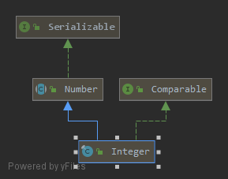
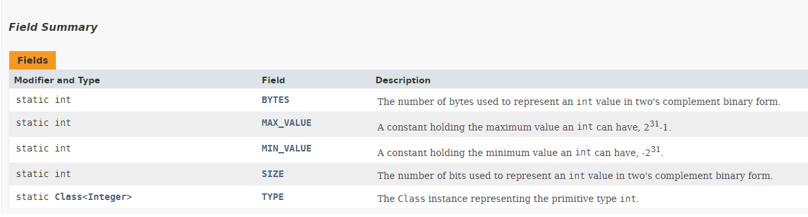
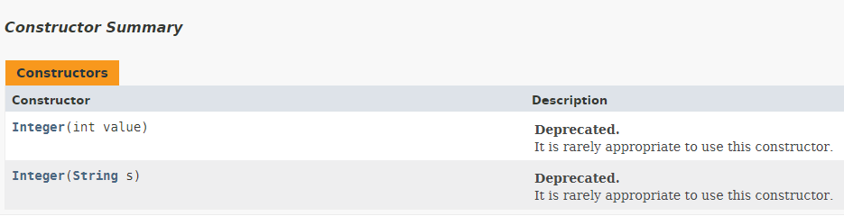

[TOC]

# 定义

- **Integer是java.lang下的一个类，不是基本数据类型**
- **final关键字，限定了Integer不能被继承，且对象一旦被创建，其字符序列将不能更改，直到该对象被销毁**
- **继承了Number并实现了Comparable接口，间接实现了Serializable接口**

```java
public final class Integer extends Number implements Comparable<Integer> 
```

- **继承树：** 



# 字段属性



```java
//int类型value用来存值
private final int value;

//最大值
@Native public static final int   MIN_VALUE = 0x80000000;

//最小值
@Native public static final int   MAX_VALUE = 0x7fffffff;

//二进制位数
@Native public static final int SIZE = 32;

//字节数=32/8=4
public static final int BYTES = SIZE / Byte.SIZE;

//指定Integer类代表基本类型int
public static final Class<Integer>  TYPE = (Class<Integer>) Class.getPrimitiveClass("int");
```


# 构造方法



```java
//JDK11中两者均已被弃用
//传值构造
public Integer(int value) {
    this.value = value;
}

//将String解析为Integer，只传递值，默认转为十进制数，支持2-36进制
public Integer(String s) throws NumberFormatException {
    this.value = parseInt(s, 10);
}
```

```java
//传入串和进制，支持2-36进制
public static int parseInt(String s, int radix)
    throws NumberFormatException
{
    /*
         * WARNING: This method may be invoked early during VM initialization
         * before IntegerCache is initialized. Care must be taken to not use
         * the valueOf method.
         */

    //格式异常判定
    if (s == null) {
        throw new NumberFormatException("null");
    }
	
    //MIN_RADIX=2，MAX_RADIX=36，不能超出支持的进制范围
    if (radix < Character.MIN_RADIX) {
        throw new NumberFormatException("radix " + radix +
                                        " less than Character.MIN_RADIX");
    }
    if (radix > Character.MAX_RADIX) {
        throw new NumberFormatException("radix " + radix +
                                        " greater than Character.MAX_RADIX");
    }
	
  	//定义一些变量
    int result = 0;
    boolean negative = false;
    int i = 0, len = s.length();
    int limit = -Integer.MAX_VALUE;
    int multmin;
    int digit;

    if (len > 0) {
        char firstChar = s.charAt(0);
        //首字符小于0，判断是否是符号位，如果不是抛出格式异常
        if (firstChar < '0') { // Possible leading "+" or "-"
            if (firstChar == '-') {
                negative = true;
                limit = Integer.MIN_VALUE;
            } else if (firstChar != '+')
                throw NumberFormatException.forInputString(s);
			
            //也不能是单独的符号位
            if (len == 1) // Cannot have lone "+" or "-"
                throw NumberFormatException.forInputString(s);
            i++;
        }
        multmin = limit / radix;
        //遍历剩余字符位
        while (i < len) {
            // Accumulating negatively avoids surprises near MAX_VALUE
            //将字符转化为对应的数字,逐个累加
            //格式异常判定
            digit = Character.digit(s.charAt(i++),radix);
            if (digit < 0) {
                throw NumberFormatException.forInputString(s);
            }
            if (result < multmin) {
                throw NumberFormatException.forInputString(s);
            }
            result *= radix;
            if (result < limit + digit) {
                throw NumberFormatException.forInputString(s);
            }
            result -= digit;
        }
    } else {
        throw NumberFormatException.forInputString(s);
    }
    //根据符号位返回正数或负数
    return negative ? result : -result;
}
```


# 部分方法解析

## toString

```java
//指定进制
public static String toString(int i, int radix) {
    if (radix < Character.MIN_RADIX || radix > Character.MAX_RADIX)
        radix = 10;

    /* Use the faster version */
    //如果是10进制，有更快的算法
    if (radix == 10) {
        return toString(i);
    }
	
    //32比特数，故最长为32位，剩余一位加入符号
    char buf[] = new char[33];
    boolean negative = (i < 0);
    int charPos = 32;
	
    if (!negative) {
        i = -i;
    }
	//从digit[]里解析字符,按位取模
    while (i <= -radix) {
        buf[charPos--] = digits[-(i % radix)];
        i = i / radix;
    }
    buf[charPos] = digits[-i];
	
    //如果是负数还要加上负号
    if (negative) {
        buf[--charPos] = '-';
    }
	
    //返回一个新的String对象
    return new String(buf, charPos, (33 - charPos));
}
```

```java
//十进制的版本
public static String toString(int i) {
    if (i == Integer.MIN_VALUE)
        return "-2147483648";
    //计算int的长度(位数)，如果是负数还要+1以保存负号
    int size = (i < 0) ? stringSize(-i) + 1 : stringSize(i);
    char[] buf = new char[size];
    //逐一转换为char并放入buf[]中
    getChars(i, size, buf);
    return new String(buf, true);
}

//返回int整数的长度+1
static int stringSize(int x) {
    for (int i=0; ; i++)
        if (x <= sizeTable[i])
            return i+1;
}

final static int [] sizeTable = { 9, 99, 999, 9999, 99999, 999999, 9999999,
                                 99999999, 999999999, Integer.MAX_VALUE };
//----------------------------------------------------

static void getChars(int i, int index, char[] buf) {
    int q, r;
    int charPos = index;
    char sign = 0;

    if (i < 0) {
        sign = '-';
        i = -i;
    }

    //一次可以解析出两位数字对应的字符
    //假定i大于65535
    while (i >= 65536) {
        q = i / 100;
        // 该位操作等价于 r = i - (q * 100);
        r = i - ((q << 6) + (q << 5) + (q << 2));
        i = q;
        //DigitOnes取出对应的字符放入buf[]
        buf [--charPos] = DigitOnes[r];
        buf [--charPos] = DigitTens[r];
    }

    // Fall thru to fast mode for smaller numbers
    // assert(i <= 65536, i);
    //当i小于65535时又有更快的算法
    for (;;) {
        q = (i * 52429) >>> (16+3);
        r = i - ((q << 3) + (q << 1));  // 等价于 r = i-(q*10) ...
        buf [--charPos] = digits [r];
        i = q;
        if (i == 0) break;
    }
    if (sign != 0) {
        buf [--charPos] = sign;
    }
}

```

==算法分析：==

还不会！待补全

## 重写hashcode方法

hashcode居然就是简单返回值本身！？

```java
public static int hashCode(int value) {
    return value;
}
```


## 重写equals方法

equals的条件：对象是Integer实例且值相同

```java
public boolean equals(Object obj) {
    if (obj instanceof Integer) {
        return value == ((Integer)obj).intValue();
    }
    return false;
}
```


## valueOf

==自动装箱==

```java
Integer x = 10；//诸如此类操作将被视为自动装箱
//将被视为以下操作
Integer x = valueOf(10);
```

自动装箱将分两种不同的情况：

- 装箱的数在[-128,127]区间内，在这区间的自动装箱将被分配为缓存
- 区间外

```java
public static Integer valueOf(int i) {
    // -128<i<127时，将使用静态内部类IntegerCache的cache方法进行创建
    if (i >= IntegerCache.low && i <= IntegerCache.high)
        return IntegerCache.cache[i + (-IntegerCache.low)];
	//否则new 一个新Integer
    return new Integer(i);
}
```

```java
private static class IntegerCache {
    static final int low = -128;
    static final int high;
    static final Integer cache[];

    static {
        // high value may be configured by property
        //上界high将使用以下方法取得的String Property进行解析
        int h = 127;
        String integerCacheHighPropValue =
            sun.misc.VM.getSavedProperty("java.lang.Integer.IntegerCache.high");
        if (integerCacheHighPropValue != null) {
            try {
                int i = parseInt(integerCacheHighPropValue);
                i = Math.max(i, 127);
                // Maximum array size is Integer.MAX_VALUE
                h = Math.min(i, Integer.MAX_VALUE - (-low) -1);
            } catch( NumberFormatException nfe) {
                // If the property cannot be parsed into an int, ignore it.
                // 如果解析失败就无视他
            }
        }
        high = h;
		
        //new一个新对象并缓存在一个数组中，今后如果要取得这个对象，内存地址将会一样
        cache = new Integer[(high - low) + 1];
        int j = low;
        for(int k = 0; k < cache.length; k++)
            cache[k] = new Integer(j++);

        // range [-128, 127] must be interned (JLS7 5.1.7)
        assert IntegerCache.high >= 127;
    }
	//默认构造方法
    private IntegerCache() {}
}


//取得property的方法，位于java.util.Properties下，看不懂
public static String getSavedProperty(String var0) {
    if (savedProps.isEmpty()) {
        throw new IllegalStateException("Should be non-empty if initialized");
    } else {
        return savedProps.getProperty(var0);
    }
}
```


## intValue

==自动拆箱==

拆箱则没有区别，只是简单返回对象的value

```java
Integer x = new integer(10);
int n=x;//诸如此类将Integer对象赋给int变量的操作被称为自动拆箱
```

```java
public int intValue() {
    return value;
}
```


# 一些问题

1. **为什么Integer的自动装箱要缓存？为什么缓存在[-128,127]这个区间？**

==来自JSR提出的要求==，具体原因有待探究 /摊/

