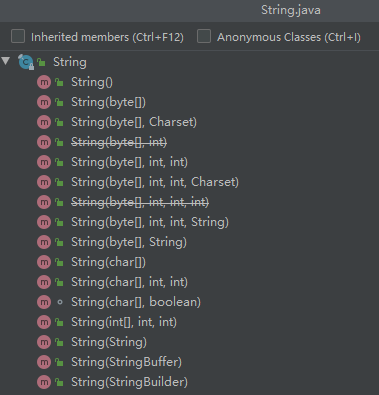

[TOC]

# 定义

- **String是java.lang下的一个类，不是基本数据类型**

- **final关键字，限定了Integer类不能被继承，且对象一旦被创建，其字符序列将不能更改，直到该对象被销毁**
- **JVM使用字符串池来存储所有String对象**

```java
public final class String
    implements java.io.Serializable, Comparable<String>, CharSequence
```

# 继承树


由图可见，String类实现了三个接口：

- **Comparable：**实现此接口以实现对每个类对象的整体排序，且此种排序被称为自然排序
- **CharSequence：**表示一个这是一个有序字符集合
- **Serializable：**标记接口，实现该接口以使用序列化


# 字段属性

```java
//用于存字符的数组
private final char value[];

//哈希值，默认为0
private int hash; // Default to 0

//序列化与反序列化时的验证UID
private static final long serialVersionUID = -6849794470754667710L;

//ObjectStreamField 的数组用于声明类的 Serializable 字段
private static final ObjectStreamField[] serialPersistentFields =
    new ObjectStreamField[0];
```


# 构造方法

String的构造方法有16种，其中两种已经弃用

构造参数包括但不限于：字符串，字符数组，字节数组，String对象，StringBuffer、StringBuilder对象




# 常用方法

## 重写equals方法

**只需value相等既满足并返回true**

```java
public boolean equals(Object anObject) {
    //比较内存中的地址
    if (this == anObject) {
        return true;
    }
    //首先得是String实例
    if (anObject instanceof String) {
        //强转
        String anotherString = (String)anObject;
        int n = value.length;
        //对char数组逐一比较value的值
        if (n == anotherString.value.length) {
            char v1[] = value;
            char v2[] = anotherString.value;
            int i = 0;
            while (n-- != 0) {
                if (v1[i] != v2[i])
                    return false;
                i++;
            }
            return true;
        }
    }
    return false;
}
```


## 重写hashcode方法

计算公式：$hashcode=s[0]*31^{(n-1)}+ s[1]*31^{(n-2)} + ... + s[n-1]$

==为什么使用31？==

1. **因为31是一个不大不小的质数，适合用于hashcode乘子**
2. **31的乘法可以被 JVM 优化， 31 * i = (i << 5) - i ，位运算比直接乘法更有效率**

```java
public int hashCode() {
    int h = hash;
    //如果没有计算过hash值且长度大于0
    if (h == 0 && value.length > 0) {
        char val[] = value;
		
        //具体算法，hash=s[0]*31^(n-1) + s[1]*31^(n-2) + ... + s[n-1]
        for (int i = 0; i < value.length; i++) {
            h = 31 * h + val[i];
        }
        hash = h;
    }
    return h;
}
```


## charAt方法

```java
public char charAt(int index) {
    //越界判定
    if ((index < 0) || (index >= value.length)) {
        throw new StringIndexOutOfBoundsException(index);
    }
    //返回char数组的对应索引
    return value[index];
}
```


## compareTo和 compareToIgnoreCase方法

```java
public int compareTo(String anotherString) {
    int len1 = value.length;
    int len2 = anotherString.value.length;
    int lim = Math.min(len1, len2);
    char v1[] = value;
    char v2[] = anotherString.value;

    int k = 0;
    //返回第一对不同字符的Unicode值差
    while (k < lim) {
        char c1 = v1[k];
        char c2 = v2[k];
        if (c1 != c2) {
            return c1 - c2;
        }
        k++;
    }
    //如果前面都一样，那么返回两个串的长度差
    return len1 - len2;
}

//和上面一样，但是忽略大小写
public int compareToIgnoreCase(String str) {
    return CASE_INSENSITIVE_ORDER.compare(this, str);
}

```


## concat方法

连接指定字符串到末尾

```java
public String concat(String str) {
    int otherLen = str.length();
    if (otherLen == 0) {
        return this;
    }
    int len = value.length;
    //拷贝创建一个新的足够大的char数组并使用getChars令str填满后面的部分
    char buf[] = Arrays.copyOf(value, len + otherLen);
    str.getChars(buf, len);
    //返回一个新的String对象
    return new String(buf, true);
}
```


## indexOf方法

查找指定字符串第一个字符对应的索引，==两层for循环暴力搜索，时间复杂度O(n*m)==

**为什么不使用KMP、 Boyer-Moore 等复杂度O(n)的算法？：JDK编写团队认为String大多数情况下都较短，使用上述算法需要用到辅助函数，消耗更多的时间和空间，短字符串的情况下并不划算**

```java
//默认搜索整个串
public int indexOf(String str) {
    return indexOf(str, 0);
}

//指定查找范围，返回首次出现该串的索引
public int indexOf(String str, int fromIndex) {
    return indexOf(value, 0, value.length,
                   str.value, 0, str.value.length, fromIndex);
}


static int indexOf(char[] source, int sourceOffset, int sourceCount,
                   String target, int fromIndex) {
    return indexOf(source, sourceOffset, sourceCount,
                   target.value, 0, target.value.length,
                   fromIndex);
}

//两层for循环暴力搜索
static int indexOf(char[] source, int sourceOffset, int sourceCount,
                   char[] target, int targetOffset, int targetCount,
                   int fromIndex) {
    if (fromIndex >= sourceCount) {
        return (targetCount == 0 ? sourceCount : -1);
    }
    if (fromIndex < 0) {
        fromIndex = 0;
    }
    if (targetCount == 0) {
        return fromIndex;
    }

    char first = target[targetOffset];
    int max = sourceOffset + (sourceCount - targetCount);

    for (int i = sourceOffset + fromIndex; i <= max; i++) {
        /* Look for first character. */
        //查找第一个匹配的字符
        if (source[i] != first) {
            while (++i <= max && source[i] != first);
        }

        /* Found first character, now look at the rest of v2 */
        //已经找到第一个匹配的字符，开始匹配后续的位置
        if (i <= max) {
            int j = i + 1;
            int end = j + targetCount - 1;
            for (int k = targetOffset + 1; j < end && source[j]
                 == target[k]; j++, k++);

            if (j == end) {
                /* Found whole string. */
                //匹配成功，返回索引
                return i - sourceOffset;
            }
        }
    }
    //匹配失败，返回-1
    return -1;
}
```


## split方法

匹配正则，分割成几部分并将结果以String数组的形式返回

根据limit取值不同有三种情况：

- limit<0：pattern应用n-1次
- limit=0：pattern应用无限次把忽略末尾空串
- limit>0：pattern应用无限次

```java
public String[] split(String regex, int limit) {
    /* fastpath if the regex is a
         (1)one-char String and this character is not one of the
            RegEx's meta characters ".$|()[{^?*+\\", or
         (2)two-char String and the first char is the backslash and
            the second is not the ascii digit or ascii letter.
         */
    char ch = 0;
    /*排除一些特殊情况：
    1.单字符的regex不能为特殊字符
    2.双字符的regex不能为双斜杠，且第二个字符不能是ASCII数字或字母
    */
    if (
        //---------------------------
        ((regex.value.length == 1 &&
          ".$|()[{^?*+\\".indexOf(ch = regex.charAt(0)) == -1) ||
         (regex.length() == 2 &&
          regex.charAt(0) == '\\' &&
          (((ch = regex.charAt(1))-'0')|('9'-ch)) < 0 &&
          ((ch-'a')|('z'-ch)) < 0 &&
          ((ch-'A')|('Z'-ch)) < 0)) &&
        //--------------------------
        (ch < Character.MIN_HIGH_SURROGATE ||
         ch > Character.MAX_LOW_SURROGATE)
        //--------------------------
       )
    {
        int off = 0;
        int next = 0;
        boolean limited = limit > 0;//大于0位true，反之为false
        ArrayList<String> list = new ArrayList<>();
        //循环直至找不到下一个匹配点
        while ((next = indexOf(ch, off)) != -1) {
            //如果没到限制数量，将分割的子串添加到结果集
            if (!limited || list.size() < limit - 1) {
                list.add(substring(off, next));
                off = next + 1;
            } else {    // last one 
                //assert (list.size() == limit - 1);
                //最后部分加入结果集并break
                list.add(substring(off, value.length));
                off = value.length;
                break;
            }
        }
        // If no match was found, return this
        //如果匹配失败，返回只有原String的数组
        if (off == 0)
            return new String[]{this};

        // Add remaining segment
        //最后部分加入结果集
        if (!limited || list.size() < limit)
            list.add(substring(off, value.length));

        // Construct result
        //构建返回的String数组
        int resultSize = list.size();
        if (limit == 0) {
            while (resultSize > 0 && list.get(resultSize - 1).length() == 0) {
                resultSize--;
            }
        }
        String[] result = new String[resultSize];
        return list.subList(0, resultSize).toArray(result);
    }
    return Pattern.compile(regex).split(this, limit);
}

//默认pattern应用无限次并忽略末尾空串
public String[] split(String regex) {
    return split(regex, 0);
}
```


## replace方法和replaceAll方法

```java
//将原串中oldChar==newChar的部分全部替换为newChar

//先将找到第一个出现oldChar的索引，将这前面的值copy到新数组中，然后遍历剩余部分，buf[i] = (c == oldChar) ? newChar : c;
//感觉写法很花里胡哨，有人能告诉我为什么这么写吗？？
public String replace(char oldChar, char newChar) {
    //oldChar不能等于newChar
    if (oldChar != newChar) {
        int len = value.length;
        int i = -1;
        char[] val = value; /* avoid getfield opcode */
		
        //遍历value找到第一个oldChar所在处的索引index=i
        while (++i < len) {
            if (val[i] == oldChar) {
                break;
            }
        }
        if (i < len) {
            //开一个新的char数组
            char buf[] = new char[len];
            for (int j = 0; j < i; j++) {//将i前的部分复制到buf[]
                buf[j] = val[j];
            }
            //遍历剩余部分，替换oldChar==newChar的部分
            while (i < len) {
                char c = val[i];
                buf[i] = (c == oldChar) ? newChar : c;
                i++;
            }
            //返回一个新的String实例
            return new String(buf, true);
        }
    }
    //oldChar==newChar时直接返回
    return this;
}

//通过正则进行替换
public String replaceAll(String regex, String replacement) {
    return Pattern.compile(regex).matcher(this).replaceAll(replacement);
}
```


## substring方法

```java
public String substring(int beginIndex, int endIndex) {
    //越界判定
    if (beginIndex < 0) {
        throw new StringIndexOutOfBoundsException(beginIndex);
    }
    if (endIndex > value.length) {
        throw new StringIndexOutOfBoundsException(endIndex);
    }
    //确定子串长度
    int subLen = endIndex - beginIndex;
    //越界判定
    if (subLen < 0) {
        throw new StringIndexOutOfBoundsException(subLen);
    }
    //调用构造方法获得子串
    return ((beginIndex == 0) && (endIndex == value.length)) ? this
        : new String(value, beginIndex, subLen);
}
```


## valueOf：各种类型转换

```java
public static String valueOf(boolean b) {
    return b ? "true" : "false";
}

public static String valueOf(char c) {
    char data[] = {c};
    return new String(data, true);
}

public static String valueOf(int i) {
    return Integer.toString(i);
}

public static String valueOf(long l) {
    return Long.toString(l);
}

public static String valueOf(float f) {
    return Float.toString(f);
}

public static String valueOf(double d) {
    return Double.toString(d);
}
```


## intern方法

这是一个本地方法，**当调用intern方法时，如果池中已经包含一个与该`String`确定的字符串相同`equals(Object)`的字符串，则返回该字符串。否则，将此`String`对象添加到池中，并返回此对象的引用。**

```java
public native String intern();
```


# 一些问题

1. **什么是字符串池？**

2. **String为什么不可改变？能不能想办法改变一下？有没有可变的String类？**

涉及到 JVM内存模型，待学习后补全


---

> 参考文章：[JDK1.8源码(三)——java.lang.String 类](https://www.cnblogs.com/ysocean/p/8571426.html)
