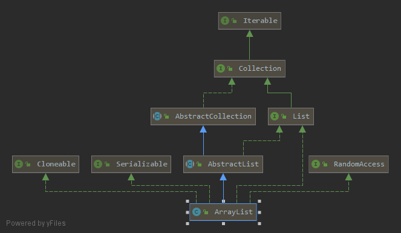

# ArrayList源码分析（JDK1.8）

**要点：**

1. 定义
2. 有什么特点？
3. 继承树？
4. 字段属性
5. 构造函数
6. 常用方法
7. 适用场景

## 1. 定义

底层用数组实现的动态数组类

```java
public class ArrayList<E> extends AbstractList<E>
 		implementsList<E>,RandomAccess,Cloneable,java.io.Serializable
```

## 2. 有什么特点？

- 随机访问速度快，插入和移除性能较差(数组的特点)

- 支持null元素

- 有顺序

- 元素可重复

- 非线程安全
- 初始长度为10，每次扩容0.5倍

## 3. ArrayList的继承树



可以看到，ArrayList继承自AbstructList类，实现了以下几个接口：

- RandomAccess：标记接口，表示支持高速随机访问

- Cloneable：标记接口，表示该类可以克隆，实现该接口才可以调用浅拷贝Object.clone()
- Serializable：标记接口，表示能被序列化
- List：定义了一系列必须实现的List方法，下面详细解释

## 4. 字段属性

```java
//它的作用就是在Java进行序列化工作时，会将serialVersioinUid与所要序列化的目标一起序列化，这样一来，在反序列化的过程中会使用被序列化的serialVersioinUid与类中的serialVersioinUid对比，如果两者相等，则反序列化成功，否则，反序列化失败。
private static final long serialVersionUID = 8683452581122892189L;

//集合默认大小
private static final int DEFAULT_CAPACITY = 10;

//空的数组实例
private static final Object[] EMPTY_ELEMENTDATA = {};

//同上，用途不同，用于了解添加元素时数组膨胀多少
private static final Object[] DEFAULTCAPACITY_EMPTY_ELEMENTDATA = {};

//存储 ArrayList集合的元素，集合的长度即这个数组的长度
//1、当 elementData == DEFAULTCAPACITY_EMPTY_ELEMENTDATA 时将会清空 ArrayList
//2、当添加第一个元素时，elementData 长度会扩展为 DEFAULT_CAPACITY=10
transient Object[] elementData;

//集合的长度
private int size;
```

## 5. 构造函数

三种构造函数：

- **无参构造**：容器初始大小为0，注释中说的容量为10是指**首次调用add方法时**被初始化为一个容量为10的容器

  ```java
  /**
   * Constructs an empty list with an initial capacity of ten.
   */
  public ArrayList() {
      this.elementData = DEFAULTCAPACITY_EMPTY_ELEMENTDATA;
  }
  ```

- **有参构造**：

  - 给定值构造：大于0时创建一个等大的数组，等于0创建空数组，小于0抛出非法参数异常

    ```java
    public ArrayList(int initialCapacity) {
        if (initialCapacity > 0) {
            this.elementData = new Object[initialCapacity];
        } else if (initialCapacity == 0) {
            this.elementData = EMPTY_ELEMENTDATA;
        } else {
            throw new IllegalArgumentException("Illegal Capacity: "+
                                               initialCapacity);
        }
    }
    ```

  - 使用已有集合进行构造：将已有的集合类通过toArray()转为数组，再copy为elementData

    ```java
    /**
    * Constructs a list containing the elements of the specified
    * collection, in the order they are returned by the collection's
    * iterator.
    *
    * @param c the collection whose elements are to be placed into this list
    * @throws NullPointerException if the specified collection is null
    */
    public ArrayList(Collection<? extends E> c) {
    elementData = c.toArray();
    if ((size = elementData.length) != 0) {
    // c.toArray might (incorrectly) not return Object[] (see 6260652)
    if (elementData.getClass() != Object[].class)
    elementData = Arrays.copyOf(elementData, size, Object[].class);
    } else {
    // replace with empty array.
    this.elementData = EMPTY_ELEMENTDATA;
    }
    }
    ```

    

## 6. 常用方法

### 增删改查

- **==添加元素==：**尾部添加 & 指定位置添加

  ```java
  //判定是否需要扩容
  //时间复杂度O(1)
  public boolean add(E e) {
  ensureCapacityInternal(size + 1);  // Increments modCount!!
  elementData[size++] = e;
  return true;
  }
  //index置为添加元素，时间复杂度O(n)
  public void add(int index, E element) {
  rangeCheckForAdd(index);
  
  ensureCapacityInternal(size + 1);  // Increments modCount!!
  System.arraycopy(elementData, index, elementData, index + 1,
  size - index);
  elementData[index] = element;
  size++;
  }
  ```

  ==**扩容判断：**==

  ```java
  //使用当前容量判断是否需要扩容
  private void ensureCapacityInternal(int minCapacity) {
      if (elementData == DEFAULTCAPACITY_EMPTY_ELEMENTDATA) {
          minCapacity = Math.max(DEFAULT_CAPACITY, minCapacity);
      }
  
      ensureExplicitCapacity(minCapacity);
  }
  
  //如果集合大小大于实际储存的数组大小,则开始扩容
  private void ensureExplicitCapacity(int minCapacity) {
      modCount++;
  
      // overflow-conscious code
      if (minCapacity - elementData.length > 0)
          grow(minCapacity);
  }
  
  //
  private void grow(int minCapacity) {
      // overflow-conscious code
      int oldCapacity = elementData.length;
      //扩容为1.5倍，二进制数向右移一位为自身的一般一半
      int newCapacity = oldCapacity + (oldCapacity >> 1);
      //如果仍小于要求大小，则直接扩为minCapcity
      if (newCapacity - minCapacity < 0)
          newCapacity = minCapacity;
      //如果要求容量过大，大于MAX_ARRAY_SIZE，使用hugeCapacity处理
      if (newCapacity - MAX_ARRAY_SIZE > 0)
          newCapacity = hugeCapacity(minCapacity);
      // minCapacity is usually close to size, so this is a win:
      elementData = Arrays.copyOf(elementData, newCapacity);
  }
  
  //处理大数组的扩容
  //如果要求容量大于MAX_ARRAY_SIZE，扩容为Integer.MAX_VALUE
  //Integer.MAX_VALUE=2^31-1=2147483647≈21亿
  //MAX_ARRAY_SIZE=Integer.MAX_VALUE-8
  private static int hugeCapacity(int minCapacity) {
      if (minCapacity < 0) // overflow
          throw new OutOfMemoryError();
      return (minCapacity > MAX_ARRAY_SIZE) ?
          Integer.MAX_VALUE :
      MAX_ARRAY_SIZE;
  }
  ```

  

- 删除元素：根据索引删除元素 & 删除指定值元素

  ```java
  //size--,index后元素全体向前移一位，最后一位置为null，时间复杂度O(n)
  public E remove(int index) {
  rangeCheck(index);
  
  modCount++;
  E oldValue = elementData(index);
  
  int numMoved = size - index - 1;
  if (numMoved > 0)
  System.arraycopy(elementData, index+1, elementData, index,
  numMoved);
  elementData[--size] = null; // clear to let GC do its work
  
  return oldValue;
  }
  
  //遍历数组，equals作判断，fastRemove
  public boolean remove(Object o) {
  if (o == null) {
  for (int index = 0; index < size; index++)
  if (elementData[index] == null) {
  fastRemove(index);
  return true;
  }
  } else {
  for (int index = 0; index < size; index++)
  if (o.equals(elementData[index])) {
  fastRemove(index);
  return true;
  }
  }
  return false;
  }
  //同索引删除
  private void fastRemove(int index) {
  modCount++;
  int numMoved = size - index - 1;
  if (numMoved > 0)
  System.arraycopy(elementData, index+1, elementData, index,
  numMoved);
  elementData[--size] = null; // clear to let GC do its work
  }
  ```

- 查询元素：根据索引查询

  ```java
  //如果越界，报越界异常IndexOutOfBoundsException
  public E get(int index) {
  rangeCheck(index);
  
  return elementData(index);
  }
  //越界判断
  private void rangeCheck(int index) {
      if (index >= size)
          throw new IndexOutOfBoundsException(outOfBoundsMsg(index));
  }
  ```

- 修改元素：修改指定索引的元素

  ```java
  public E set(int index, E element) {
  //越界判定
  rangeCheck(index);
  
  E oldValue = elementData(index);
  elementData[index] = element;
  return oldValue;
  }
  ```

- 迭代器Iterator：内部类实现Iterator接口

  ```java
  public Iterator<E> iterator() {
  return new Itr();
  }
  ```

  ```java
  private class Itr implements Iterator<E> {
      int cursor;       //游标， 下一个要返回的元素的索引
      int lastRet = -1; // 返回最后一个元素的索引; 如果没有这样的话返回-1.
      int expectedModCount = modCount;
  
      //通过 cursor ！= size 判断是否还有下一个元素
      public boolean hasNext() {
          return cursor != size;
      }
  
      @SuppressWarnings("unchecked")
      public E next() {
          checkForComodification();//迭代器进行元素迭代时同时进行增加和删除操作，会抛出异常
          int i = cursor;
          if (i >= size)
              throw new NoSuchElementException();
          Object[] elementData = ArrayList.this.elementData;
          if (i >= elementData.length)
              throw new ConcurrentModificationException();
          cursor = i + 1;//游标向后移动一位
          return (E) elementData[lastRet = i];//返回索引为i处的元素，并将 lastRet赋值为i
      }
  
      public void remove() {
          if (lastRet < 0)
              throw new IllegalStateException();
          checkForComodification();
  
          try {
              ArrayList.this.remove(lastRet);//调用ArrayList的remove方法删除元素
              cursor = lastRet;//游标指向删除元素的位置，本来是lastRet+1的，这里删除一个元素，然后游标就不变了
              lastRet = -1;//lastRet恢复默认值-1
              expectedModCount = modCount;//expectedModCount值和modCount同步，因为进行add和remove操作，modCount会加1
          } catch (IndexOutOfBoundsException ex) {
              throw new ConcurrentModificationException();
          }
      }
  
      @Override
      @SuppressWarnings("unchecked")
      public void forEachRemaining(Consumer<? super E> consumer) {//便于进行forEach循环
          Objects.requireNonNull(consumer);
          final int size = ArrayList.this.size;
          int i = cursor;
          if (i >= size) {
              return;
          }
          final Object[] elementData = ArrayList.this.elementData;
          if (i >= elementData.length) {
              throw new ConcurrentModificationException();
          }
          while (i != size && modCount == expectedModCount) {
              consumer.accept((E) elementData[i++]);
          }
          // update once at end of iteration to reduce heap write traffic
          cursor = i;
          lastRet = i - 1;
          checkForComodification();
      }
  
      //前面在新增元素add() 和 删除元素 remove() 时，我们可以看到 modCount++。修改set() 是没有的
      //如果在迭代器进行迭代时同时进行增添和删除，会抛出ConcurrentModificationException
      final void checkForComodification() {
          if (modCount != expectedModCount)
              throw new ConcurrentModificationException();
      }
  }
  ```

  ConcurrentModificationException的解决办法是使用迭代器的remove方法：

  ```java
  it.remove()
  ```

- trimToSize():在确定不需要添加元素后，用时间换空间，将容器大小调整为实际所需的大小

  ```java
  public void trimToSize() {
          modCount++;
          if (size < elementData.length) {
              elementData = (size == 0)
                ? EMPTY_ELEMENTDATA
                : Arrays.copyOf(elementData, size);
          }
      }
  ```


## 7. 适用场景

由以上分析可见，由于底层是用==数组==实现的，插入和删除需要消耗==O(n)==的时间，因此ArrayList==不适合大量的增删操作==，而通过索引查找消耗较少，==适合快速随机访问==


参考文章：

>[JDK1.8源码(五)——java.util.ArrayList 类](https://www.cnblogs.com/ysocean/p/8622264.html)
>
>[Java集合类详解(1) -- 从JDK1.8源码看ArrayList](https://blog.csdn.net/Geffin/article/details/89788535)