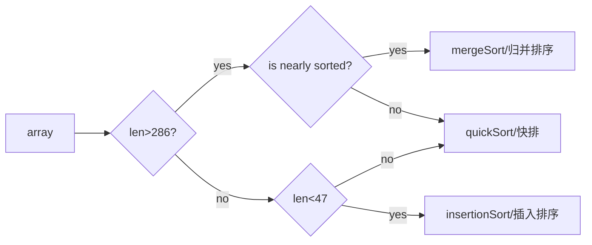

[TOC]

# 定义

- Arrays是java.util下的一个类，类中的方法（几乎都是static方法）用于各种数组相关的操作
- **所有方法都抛出空指针异常**
- 最早出现于**jdk1.2**
- 用到的排序算法有

```java
public class Arrays
```


# 字段属性

定义了一些使用特定排序算法的阈值

```java
//使用并行排序的最小数组长度，低于此长度使用并行任务将会导致内存占用，从而令并行排序失效
//长度为2^13=8192，也即大于此值才会使用并行排序
private static final int MIN_ARRAY_SORT_GRAN = 1 << 13;

//数组大小小于等于此值时，将优先使用插入排序而不是归并排序
//To be removed in a future release.后续版本中可能会删除
private static final int INSERTIONSORT_THRESHOLD = 7;
```


# 排序算法的选择策略

## Sort(经典排序)

**根据传入数组的不同可能会使用以下三种算法：**

|              | （时间复杂度）平均 | （时间复杂度）最优 | （时间复杂度）最差 |
| ------------ | ------------------ | ------------------ | ------------------ |
| **快速排序** | $O(nlog(n))$       | $O(nlog(n))$       | $O(n^2)$           |
| **插入排序** | $O(n^2)$           | $O(n)$             | $O(n^2)$           |
| **归并排序** | $O(nlog(n))$       | $O(nlog(n))$       | $O(nlog(n))$       |


```java
//传入基本类型数组，默认调用外部类DualPivotQuicksort的sort方法
public static void sort(int[] a) {
    DualPivotQuicksort.sort(a, 0, a.length - 1, null, 0, 0);
}
//此方法还有其他基本类型的重载版本，可以指定排序范围fromIndex，toIndex
//包括long、short、char、byte、float、double
public static void sort(int[] a, int fromIndex, int toIndex) 

```

```java
//DualPivotQuicksort中的sort
static void sort(int[] a, int left, int right,
                 int[] work, int workBase, int workLen) {
    // Use Quicksort on small arrays
    // QUICKSORT_THRESHOLD = 286
    // 大于47，小于286的小数组将使用快排 ** 小于47将使用插入排序 **
    if (right - left < QUICKSORT_THRESHOLD) {
        sort(a, left, right, true);
        return;
    }

    /*
         * Index run[i] is the start of i-th run
         * (ascending or descending sequence).
         */
    int[] run = new int[MAX_RUN_COUNT + 1];
    int count = 0; run[0] = left;

    // 检查该数组是否基本有序
    for (int k = left; k < right; run[count] = k) {
        if (a[k] < a[k + 1]) { // ascending 升序
            while (++k <= right && a[k - 1] <= a[k]);
        } else if (a[k] > a[k + 1]) { // descending 降序
            while (++k <= right && a[k - 1] >= a[k]);
            for (int lo = run[count] - 1, hi = k; ++lo < --hi; ) {
                int t = a[lo]; a[lo] = a[hi]; a[hi] = t;
            }
        } else { // equal
            for (int m = MAX_RUN_LENGTH; ++k <= right && a[k - 1] == a[k]; ) {
                if (--m == 0) {
                    sort(a, left, right, true);
                    return;
                }
            }
        }

        //数组如果不是高度结构化的，即不是基本有序的，将视情况使用快排或插入排序
        //跳转到private static void sort(int[] a, int left, int right, boolean leftmost)
        if (++count == MAX_RUN_COUNT) {
            sort(a, left, right, true);
            return;
        }
    }

    //检查特殊情况
    // Implementation note: variable "right" is increased by 1.
    if (run[count] == right++) { // The last run contains one element
        run[++count] = right;
    } else if (count == 1) { // 已经是有序数组
        return;
    }

    // Determine alternation base for merge
    byte odd = 0;
    for (int n = 1; (n <<= 1) < count; odd ^= 1);

    // 使用一个临时数组b用于归并
    int[] b;                 // 临时数组，和a进行归并
    int ao, bo;              // 范围偏置
    int blen = right - left; // b需要的最小长度
    if (work == null || workLen < blen || workBase + blen > work.length) {
        work = new int[blen];
        workBase = 0;
    }
    if (odd == 0) {
        System.arraycopy(a, left, work, workBase, blen);
        b = a;
        bo = 0;
        a = work;
        ao = workBase - left;
    } else {
        b = work;
        ao = 0;
        bo = workBase - left;
    }

    // 开始归并
    for (int last; count > 1; count = last) {
        for (int k = (last = 0) + 2; k <= count; k += 2) {
            int hi = run[k], mi = run[k - 1];
            for (int i = run[k - 2], p = i, q = mi; i < hi; ++i) {
                if (q >= hi || p < mi && a[p + ao] <= a[q + ao]) {
                    b[i + bo] = a[p++ + ao];
                } else {
                    b[i + bo] = a[q++ + ao];
                }
            }
            run[++last] = hi;
        }
        if ((count & 1) != 0) {
            for (int i = right, lo = run[count - 1]; --i >= lo;
                 b[i + bo] = a[i + ao]
                );
            run[++last] = right;
        }
        int[] t = a; a = b; b = t;
        int o = ao; ao = bo; bo = o;
    }
}
```

```java
//如果数组结构化程度不高，跳转至此
private static void sort(int[] a, int left, int right, boolean leftmost) {
    int length = right - left + 1;

    // 此时长度小于47的数组将会变成插入排序，反之快排
    if (length < INSERTION_SORT_THRESHOLD) {
        if (leftmost) {
            /*
                 * Traditional (without sentinel) insertion sort,
                 * optimized for server VM, is used in case of
                 * the leftmost part.
                 */
            for (int i = left, j = i; i < right; j = ++i) {
                int ai = a[i + 1];
                while (ai < a[j]) {
                    a[j + 1] = a[j];
                    if (j-- == left) {
                        break;
                    }
                }
                a[j + 1] = ai;
            }
        } else {
            /*
                 * Skip the longest ascending sequence.
                 */
            do {
                if (left >= right) {
                    return;
                }
            } while (a[++left] >= a[left - 1]);

            /*
                 * Every element from adjoining part plays the role
                 * of sentinel, therefore this allows us to avoid the
                 * left range check on each iteration. Moreover, we use
                 * the more optimized algorithm, so called pair insertion
                 * sort, which is faster (in the context of Quicksort)
                 * than traditional implementation of insertion sort.
                 */
            for (int k = left; ++left <= right; k = ++left) {
                int a1 = a[k], a2 = a[left];

                if (a1 < a2) {
                    a2 = a1; a1 = a[left];
                }
                while (a1 < a[--k]) {
                    a[k + 2] = a[k];
                }
                a[++k + 1] = a1;

                while (a2 < a[--k]) {
                    a[k + 1] = a[k];
                }
                a[k + 1] = a2;
            }
            int last = a[right];

            while (last < a[--right]) {
                a[right + 1] = a[right];
            }
            a[right + 1] = last;
        }
        return;
    }

```


由以上分析可见，**sort的算法选择策略**可以用以下流程图表示:



## parallelSort(并发排序)

==该类方法是jdk1.8新增的，使用一些并发排序算法==

==看不太懂，待补全，请自行忽略本节==

```java
//如果小于MIN_ARRAY_SORT_GRAN=2^13=8192,将使用经典排序
//唤醒一个外部类ArraysParallelSortHelpers的内部类的内部类Sorter
public static void parallelSort(byte[] a) {
    int n = a.length, p, g;
    if (n <= MIN_ARRAY_SORT_GRAN ||
        (p = ForkJoinPool.getCommonPoolParallelism()) == 1)
        DualPivotQuicksort.sort(a, 0, n - 1);
    else
        // n/p
        new ArraysParallelSortHelpers.FJByte.Sorter
        (null, a, new byte[n], 0, n, 0,
         ((g = n / (p << 2)) <= MIN_ARRAY_SORT_GRAN) ?
         MIN_ARRAY_SORT_GRAN : g).invoke();
}

//同样有多个重载版本，可以指定排序范围
//支持多种基本数据类型：byte、char、short、int、long、float、double
public static void parallelSort(byte[] a, int fromIndex, int toIndex)
```

```java
static final class Sorter extends CountedCompleter<Void> {
    static final long serialVersionUID = 2446542900576103244L;
    final float[] a, w;
    final int base, size, wbase, gran;
    //构造方法
    Sorter(CountedCompleter<?> par, float[] a, float[] w, int base,
           int size, int wbase, int gran) {
        super(par);
        this.a = a; this.w = w; this.base = base; this.size = size;
        this.wbase = wbase; this.gran = gran;
    }
    //
    public final void compute() {
        CountedCompleter<?> s = this;
        float[] a = this.a, w = this.w; // localize all params
        int b = this.base, n = this.size, wb = this.wbase, g = this.gran;
        while (n > g) {
            int h = n >>> 1, q = h >>> 1, u = h + q; // quartiles
            Relay fc = new Relay(new Merger(s, w, a, wb, h,
                                            wb+h, n-h, b, g));
            Relay rc = new Relay(new Merger(fc, a, w, b+h, q,
                                            b+u, n-u, wb+h, g));
            
            //开启
            new Sorter(rc, a, w, b+u, n-u, wb+u, g).fork();
            new Sorter(rc, a, w, b+h, q, wb+h, g).fork();;
            Relay bc = new Relay(new Merger(fc, a, w, b, q,
                                            b+q, h-q, wb, g));
            new Sorter(bc, a, w, b+q, h-q, wb+q, g).fork();
            s = new EmptyCompleter(bc);
            n = q;
        }
        DualPivotQuicksort.sort(a, b, b + n - 1, w, wb, n);
        s.tryComplete();
    }
}

```


# 部分方法解析

## equals & deepEquals

```java
//支持所有基本数据类型和对象，其中对象的比较使用equals，具体要看传入的类是否重写了equals方法
public static boolean equals(long[] a, long[] a2) {
    //地址相同，判定为相同
    if (a==a2)
        return true;
    //都为null，判定为不同
    if (a==null || a2==null)
        return false;
	
    int length = a.length;
    if (a2.length != length)
        return false;
	//逐一对比元素
    for (int i=0; i<length; i++)
        if (a[i] != a2[i])
            return false;

    return true;
}
```

```java
//深度判同，支持多维数组和多层嵌套
static boolean deepEquals0(Object e1, Object e2) {
    assert e1 != null;
    boolean eq;
    if (e1 instanceof Object[] && e2 instanceof Object[])
        eq = deepEquals ((Object[]) e1, (Object[]) e2);
    else if (e1 instanceof byte[] && e2 instanceof byte[])
        eq = equals((byte[]) e1, (byte[]) e2);
    else if (e1 instanceof short[] && e2 instanceof short[])
        eq = equals((short[]) e1, (short[]) e2);
    else if (e1 instanceof int[] && e2 instanceof int[])
        eq = equals((int[]) e1, (int[]) e2);
    else if (e1 instanceof long[] && e2 instanceof long[])
        eq = equals((long[]) e1, (long[]) e2);
    else if (e1 instanceof char[] && e2 instanceof char[])
        eq = equals((char[]) e1, (char[]) e2);
    else if (e1 instanceof float[] && e2 instanceof float[])
        eq = equals((float[]) e1, (float[]) e2);
    else if (e1 instanceof double[] && e2 instanceof double[])
        eq = equals((double[]) e1, (double[]) e2);
    else if (e1 instanceof boolean[] && e2 instanceof boolean[])
        eq = equals((boolean[]) e1, (boolean[]) e2);
    else
        eq = e1.equals(e2);
    return eq;
}
```


## toString & deepToString

```java
//支持基本类型数据和对象
//使用StringBuilder构建字符串
public static String toString(long[] a) {
    if (a == null)
        return "null";
    int iMax = a.length - 1;
    if (iMax == -1)
        return "[]";

    StringBuilder b = new StringBuilder();
    b.append('[');
    for (int i = 0; ; i++) {
        b.append(a[i]);
        if (i == iMax)
            return b.append(']').toString();
        b.append(", ");
    }
}

//支持多维数组和多重嵌套的toString
public static String deepToString(Object[] a) {
    if (a == null)
        return "null";
	
    //预留20倍长度
    int bufLen = 20 * a.length;
    if (a.length != 0 && bufLen <= 0)
        bufLen = Integer.MAX_VALUE;
    StringBuilder buf = new StringBuilder(bufLen);
    deepToString(a, buf, new HashSet<Object[]>());
    return buf.toString();
}
```


## fill

快速填充数组

```java
public static void fill(long[] a, long val) {
    for (int i = 0, len = a.length; i < len; i++)
        a[i] = val;
}

//支持所有基本类型数据和对象
public static void fill(long[] a, int fromIndex, int toIndex, long val) {
    //越界判定
    rangeCheck(a.length, fromIndex, toIndex);
    for (int i = fromIndex; i < toIndex; i++)
        a[i] = val;
}
```


## binarySearch

```java
public static int binarySearch(long[] a, long key) {
    return binarySearch0(a, 0, a.length, key);
}

//经典二分查找,前提是数组必须有序
private static int binarySearch0(long[] a, int fromIndex, int toIndex,
                                 long key) {
    //头尾指针
    int low = fromIndex;
    int high = toIndex - 1;
	
    //注意循环的终止条件是小于等于，如果写成小于的话会出现找不到的情况
    while (low <= high) {
        int mid = (low + high) >>> 1;
        long midVal = a[mid];

        if (midVal < key)
            low = mid + 1;
        else if (midVal > key)
            high = mid - 1;
        else
            return mid; // 返回所查值的key
    }
    return -(low + 1);  // 找不到，返回一个负数-(low+1)
}

```


## asList

```java
//使用ArrayList的构造方法返回list
public static <T> List<T> asList(T... a) {
    return new ArrayList<>(a);
}
```


# 从Arrays类看排序算法的适用场景

==待补全==