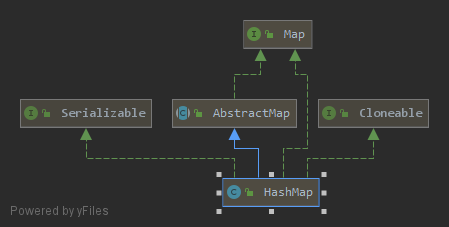

# HashMap源码分析(JDK1.8)

**要点：**

1. 定义
2. 有什么特点？
3. 继承树
4. 字段属性
5. 构造函数
6. 核心方法
7. 常用方法
8. 适用场景


## 1. 定义

```java
public class HashMap<K,V> extends AbstractMap<K,V>
    implements Map<K,V>, Cloneable, Serializable
```


## 2. 有什么特点？

- 散列表
- 查值时间复杂度O(1)
- 无序
- key不可重复
- kv均可为null
- 底层使用数组+链表+红黑树实现，其中红黑树是JDK1.8新增的特性，1.7时代采用的是数组+链表的形式
- 非线程安全

## 3. 继承树



由图可见，HashMap继承自AbstructMap类，实现了以下几个接口：

- Cloneable：标记接口，表示该类可以克隆，实现该接口才可以调用浅拷贝Object.clone()
- Serializable：标记接口，表示能被序列化

- Map：定义了一系列Map相关的方法，下面再详细分析


## 4. 字段属性

### 一些默认值

```java
//序列化与反序列化验证UID
private static final long serialVersionUID = 362498820763181265L;

//容器初始大小，1左移四位即10000即十进制16
static final int DEFAULT_INITIAL_CAPACITY = 1 << 4; // aka 16

//集合最大容量，2^30,如果默认带参构造大于此数，则依然使用默认值
static final int MAXIMUM_CAPACITY = 1 << 30;

//默认填充因子
static final float DEFAULT_LOAD_FACTOR = 0.75f;

//红黑树的阈值，当桶上的节点数大于此值时将转化为红黑树
static final int TREEIFY_THRESHOLD = 8;

//链表阈值，当桶上的节点数小于此值时将转化为链表
static final int UNTREEIFY_THRESHOLD = 6;

//当集合容量大于此值时，桶才能树形化，否则将会扩容
//为避免树形化与扩容的冲突，此值不能小于4 * TREEIFY_THRESHOLD
static final int MIN_TREEIFY_CAPACITY = 64;
```

### JDK1.8新增字段：

```java
//初始化使用，长度总是 2的幂
transient Node<K,V>[] table;

//保存缓存的entrySet（）
transient Set<Map.Entry<K,V>> entrySet;

//此映射中包含的键值映射的数量。（集合存储键值对的数量）
transient int size;

//跟前面ArrayList和LinkedList集合中的字段modCount一样，记录集合被修改的次数主要用于迭代器中的快速失败
transient int modCount;

//，当前已占用数组长度的最大值，用来调整大小的下一个大小值（容量*加载因子）
//计算公式=capacity * load factor，超过此值将扩容为原来的两倍
int threshold;

//散列表的加载因子
final float loadFactor;
```


## 5. 构造函数

### **无参构造：**加载因子为默认值0.75f

```java
public HashMap() {
        this.loadFactor = DEFAULT_LOAD_FACTOR; // all other fields defaulted
    }
```

### **有参构造：**仅指定容器大小 & 指定容器大小和加载因子

```java
//指定大小和加载因子
public HashMap(int initialCapacity, float loadFactor) {
    //指定容量小于0，抛出非法参数异常
    if (initialCapacity < 0)
        throw new IllegalArgumentException("Illegal initial capacity: " +
                                           initialCapacity);
    //如果指定容量大于MAXIMUM_CAPACITY 1 << 30 ,容量默认为MAXIMUM_CAPACITY
    if (initialCapacity > MAXIMUM_CAPACITY)
        initialCapacity = MAXIMUM_CAPACITY;
    //指定加载因子小于0或为NaN，抛出非法参数异常
    if (loadFactor <= 0 || Float.isNaN(loadFactor))
        throw new IllegalArgumentException("Illegal load factor: " +
                                           loadFactor);
    this.loadFactor = loadFactor;
    //返回值为大于等于initialCapacity的最小的2的次幂
    this.threshold = tableSizeFor(initialCapacity);
}

//仅指定大小，使用默认加载因子
//回调第一个构造方法
public HashMap(int initialCapacity) {
    this(initialCapacity, DEFAULT_LOAD_FACTOR);
}
```

==tableSizeFor()方法：==

**实质：**将最高位的1后面的位均置为1，最后结果再+1，即为大于等于cap的最小二次幂

**为什么要n=cap-1：**如果cap为2的整数次幂，返回的结果将是cap的两倍而不是cap自身

**时间复杂度：**$O(1)$

```java
//返回大于等于cap的最小二次幂
static final int tableSizeFor(int cap) {
    int n = cap - 1;
    n |= n >>> 1;
    n |= n >>> 2;
    n |= n >>> 4;
    n |= n >>> 8;
    n |= n >>> 16;
    //如果小于0为1，大于最大容量则为最大容量，否则为n+1
    return (n < 0) ? 1 : (n >= MAXIMUM_CAPACITY) ? MAXIMUM_CAPACITY : n + 1;
}
```


## 6. 核心方法

### 散列函数：hash(Object key),用于确定哈希桶数组索引位置

```java
static final int hash(Object key) {
    int h;
    return (key == null) ? 0 : (h = key.hashCode()) ^ (h >>> 16);
}

i = (table.length - 1) & hash;//这一步是在后面添加元素putVal()方法中进行位置的确定
```

**分为三步：**

1. 取得hashCode，key.hashCode()
2. 高16位 h >>> 16
3. 取模运算：(n-1) & hash

==两个问题：==

- **为什么数组长度必须是2的次幂：**相较于hash % length的较大开销，jdk1.8的取模运算选择了(n-1) & hash的方式，当length为2的次幂时，与运算等价于取模，大大了提高效率
- **为什么高位参与运算：** hashCode() 得到的是一个32位 int 类型的值，通过hashCode()的高16位 **异或** 低16位实现的：(h = k.hashCode()) ^ (h >>> 16)，主要是从速度、功效、质量来考虑的，这么做可以在数组table的length比较小的时候，也能保证考虑到高低Bit都参与到Hash的计算中，同时不会有太大的开销


### 扩容方法：resize()

```java
final Node<K,V>[] resize() {
        Node<K,V>[] oldTab = table;
        int oldCap = (oldTab == null) ? 0 : oldTab.length;//原数组如果为null，则长度赋值0
        int oldThr = threshold;
        int newCap, newThr = 0;
        if (oldCap > 0) {//如果原数组长度大于0
            if (oldCap >= MAXIMUM_CAPACITY) {//数组大小如果已经大于等于最大值(2^30)
                threshold = Integer.MAX_VALUE;//修改阈值为int的最大值(2^31-1)，这样以后就不会扩容了
                return oldTab;
            }
            //原数组长度大于等于初始化长度16，并且原数组长度扩大1倍也小于2^30次方
            else if ((newCap = oldCap << 1) < MAXIMUM_CAPACITY &&
                     oldCap >= DEFAULT_INITIAL_CAPACITY)
                newThr = oldThr << 1; // 阀值扩大1倍
        }
        else if (oldThr > 0) //旧阀值大于0，则将新容量直接等于就阀值 
            newCap = oldThr;
        else {//阀值等于0，oldCap也等于0（集合未进行初始化）
            newCap = DEFAULT_INITIAL_CAPACITY;//数组长度初始化为16
            newThr = (int)(DEFAULT_LOAD_FACTOR * DEFAULT_INITIAL_CAPACITY);//阀值等于16*0.75=12
        }
        //计算新的阀值上限
        if (newThr == 0) {
            float ft = (float)newCap * loadFactor;
            newThr = (newCap < MAXIMUM_CAPACITY && ft < (float)MAXIMUM_CAPACITY ?
                      (int)ft : Integer.MAX_VALUE);
        }
        threshold = newThr;
        @SuppressWarnings({"rawtypes","unchecked"})
            Node<K,V>[] newTab = (Node<K,V>[])new Node[newCap];
        table = newTab;
        if (oldTab != null) {
            //把每个bucket都移动到新的buckets中
            for (int j = 0; j < oldCap; ++j) {
                Node<K,V> e;
                if ((e = oldTab[j]) != null) {
                    oldTab[j] = null;//元数据j位置置为null，便于垃圾回收
                    if (e.next == null)//数组没有下一个引用（不是链表）
                        newTab[e.hash & (newCap - 1)] = e;
                    else if (e instanceof TreeNode)//红黑树
                        ((TreeNode<K,V>)e).split(this, newTab, j, oldCap);
                    else { // preserve order
                        Node<K,V> loHead = null, loTail = null;
                        Node<K,V> hiHead = null, hiTail = null;
                        Node<K,V> next;
                        do {
                            next = e.next;
                            //原索引
                            if ((e.hash & oldCap) == 0) {
                                if (loTail == null)
                                    loHead = e;
                                else
                                    loTail.next = e;
                                loTail = e;
                            }
                            //原索引+oldCap
                            else {
                                if (hiTail == null)
                                    hiHead = e;
                                else
                                    hiTail.next = e;
                                hiTail = e;
                            }
                        } while ((e = next) != null);
                        //原索引放到bucket里
                        if (loTail != null) {
                            loTail.next = null;
                            newTab[j] = loHead;
                        }
                        //原索引+oldCap放到bucket里
                        if (hiTail != null) {
                            hiTail.next = null;
                            newTab[j + oldCap] = hiHead;
                        }
                    }
                }
            }
        }
        return newTab;
    }
```


## 7.常用方法

### 添加元素

```java
//hash(key)求得哈希值和键值对一起作为属性传入
public V put(K key, V value) {
    return putVal(hash(key), key, value, false, true);
}

/**
 * @param onlyIfAbsent true 表示不要更改现有值
 * @param evict false表示table处于创建模式
 */
final V putVal(int hash, K key, V value, boolean onlyIfAbsent,
               boolean evict) {
    Node<K,V>[] tab; Node<K,V> p; int n, i;
    //如果table为空则进行初始化
    if ((tab = table) == null || (n = tab.length) == 0)
        n = (tab = resize()).length;  //返回扩容后的容器大小
    //如果是该hash位的第一个元素，则直接插入该元素
    if ((p = tab[i = (n - 1) & hash]) == null)
        tab[i] = newNode(hash, key, value, null);
    //否则要进一步判断
    else {
        Node<K,V> e; K k;
        //该key位已经有值->直接覆盖原有值
        if (p.hash == hash &&
            ((k = p.key) == key || (key != null && key.equals(k))))
            e = p;
        //没有值且该链是红黑树：将节点添加进红黑树
        else if (p instanceof TreeNode)
            e = ((TreeNode<K,V>)p).putTreeVal(this, tab, hash, key, value);
        //没有值且该链是链表：加入到表尾
        else {
            for (int binCount = 0; ; ++binCount) {
                if ((e = p.next) == null) {
                    p.next = newNode(hash, key, value, null);
                    //如果节点加入后链表表长大于8，变为红黑树
                    if (binCount >= TREEIFY_THRESHOLD - 1) // -1 for 1st
                        treeifyBin(tab, hash);
                    break;
                }
                //key已经存在，直接覆盖value
                if (e.hash == hash &&
                    ((k = e.key) == key || (key != null && key.equals(k))))
                    break;
                p = e;
            }
        }
        if (e != null) { // existing mapping for key
            V oldValue = e.value;
            if (!onlyIfAbsent || oldValue == null)
                e.value = value;
            afterNodeAccess(e);
            return oldValue;
        }
    }
    //更新modCount
    ++modCount;
    //更新size，如果size超过阈值需要扩容
    if (++size > threshold)
        resize();
    afterNodeInsertion(evict);
    return null;
}
```

### 删除元素

```java
public V remove(Object key) {
    Node<K,V> e;
    return (e = removeNode(hash(key), key, null, false, true)) == null ?
        null : e.value;
}

final Node<K,V> removeNode(int hash, Object key, Object value,
                           boolean matchValue, boolean movable) {
    Node<K,V>[] tab; Node<K,V> p; int n, index;
    //找到桶的位置
    if ((tab = table) != null && (n = tab.length) > 0 &&
        (p = tab[index = (n - 1) & hash]) != null) {
        Node<K,V> node = null, e; K k; V v;
        //如果键与链表第一个节点相等，则将node设为该节点
        if (p.hash == hash &&
            ((k = p.key) == key || (key != null && key.equals(k))))
            node = p;
        //如果桶存在下一个节点
        else if ((e = p.next) != null) {
            //节点为红黑树节点
            if (p instanceof TreeNode)
                //找到需要删除的节点
                node = ((TreeNode<K,V>)p).getTreeNode(hash, key);
            //节点为链表节点
            else {
                //遍历链表，找到需要删除的节点
                do {
                    if (e.hash == hash &&
                        ((k = e.key) == key ||
                         (key != null && key.equals(k)))) {
                        node = e;
                        break;
                    }
                    p = e;
                } while ((e = e.next) != null);
            }
        }
        //删除节点，并调整红黑树的平衡
        if (node != null && (!matchValue || (v = node.value) == value ||
                             (value != null && value.equals(v)))) {
            if (node instanceof TreeNode)
                ((TreeNode<K,V>)node).removeTreeNode(this, tab, movable);
            else if (node == p)
                tab[index] = node.next;
            else
                p.next = node.next;
            ++modCount;
            --size;
            afterNodeRemoval(node);
            return node;
        }
    }
    return null;
}
```


### 查找元素

1. **根据key进行查找:**

```java
//根据key计算出hash值进行查找
public V get(Object key) {
    Node<K,V> e;
    return (e = getNode(hash(key), key)) == null ? null : e.value;
}

final Node<K,V> getNode(int hash, Object key) {
    Node<K,V>[] tab; Node<K,V> first, e; int n; K k;
    if ((tab = table) != null && (n = tab.length) > 0 &&
        (first = tab[(n - 1) & hash]) != null) {
        //如果第一个元素就是所找元素，直接返回
        if (first.hash == hash && // always check first node
            ((k = first.key) == key || (key != null && key.equals(k))))
            return first;
        //第一个不是所找元素，且链表或红黑树不止一个节点
        if ((e = first.next) != null) {
            //如果是红黑树，找到对应元素并返回
            if (first instanceof TreeNode)
                return ((TreeNode<K,V>)first).getTreeNode(hash, key);
            //否则遍历链表进行查找
            do {
                if (e.hash == hash &&
                    ((k = e.key) == key || (key != null && key.equals(k))))
                    return e;
            } while ((e = e.next) != null);
        }
    }
    //如果没找到，返回null
    return null;
}
```

2. **判断是否存在给定的key或value：**

```java
//同上，不返回元素而是返回true/false
public boolean containsKey(Object key) {
    return getNode(hash(key), key) != null;
}

//遍历所有桶，桶内的链表或红黑树
public boolean containsValue(Object value) {
    Node<K,V>[] tab; V v;
    if ((tab = table) != null && size > 0) {
        for (int i = 0; i < tab.length; ++i) {
            for (Node<K,V> e = tab[i]; e != null; e = e.next) {
                if ((v = e.value) == value ||
                    (value != null && value.equals(v)))
                    return true;
            }
        }
    }
    return false;
}
```


### 修改元素

**同添加，直接覆盖原有值**


### 遍历集合

1. **key集合：map.keySet()**
2. **value集合：map.valueSet()**
3. **Entry集合：map.getEntrySet()**
4. **迭代器：以上三者均可取得iterator,取代for循环进行迭代效率更高**


## 8. 适用场景

适用于==非并发场景==，需要大量快速访问键值对的场景