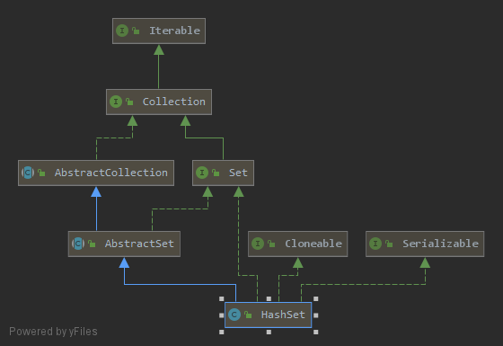
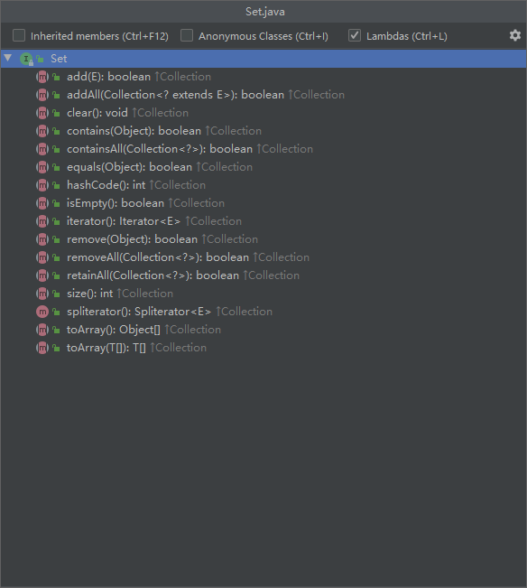

# HashSet源码分析(JDK1.8)

**要点：**

1. 定义
2. 有什么特点？
3. 继承树
4. 字段属性
5. 构造函数
6. 常用方法
7. 适用场景


## 1. 定义

```java
public class HashSet<E>
    extends AbstractSet<E>
    implements Set<E>, Cloneable, java.io.Serializable
```


## 2. 有什么特点？

- 散列表
- 查值时间复杂度O(1)
- 无序
- 没有value的HashMap
- 非线程安全(因为Hashmap是非线程安全)

## 3. 继承树




由图可见，HashSet继承自AbstructSet类，实现了以下几个接口：

- Cloneable：标记接口，表示该类可以克隆，实现该接口才可以调用浅拷贝Object.clone()

- Serializable：标记接口，表示能被序列化

- Set:接口需要重写的方法如下图

  同Hashmap几乎一致，只是对应map的地方变成了Set，继承自AbstractSet类，实现Set接口：




## 4. 字段属性

```java
//序列化与反序列化时的验证UID
static final long serialVersionUID = -5024744406713321676L;

//通过HashMap实现
private transient HashMap<E,Object> map;

// Dummy value to associate with an Object in the backing Map
private static final Object PRESENT = new Object();

```


## 5.构造方法

### 无参构造

```java
//直接new一个默认大小=16，默认加载因子=0.75的HashMap
public HashSet() {
    map = new HashMap<>();
}
```

### 有参构造

```java
//构造包含指定容器元素的Set
public HashSet(Collection<? extends E> c) {
    map = new HashMap<>(Math.max((int) (c.size()/.75f) + 1, 16));
    addAll(c);
}
//指定容器大小和加载因子
public HashSet(int initialCapacity, float loadFactor) {
    map = new HashMap<>(initialCapacity, loadFactor);
}
//仅指定容器大小
public HashSet(int initialCapacity) {
    map = new HashMap<>(initialCapacity);
}
//构造指定容器大小，加载因子的linkedHashSet，论外
HashSet(int initialCapacity, float loadFactor, boolean dummy) {
    map = new LinkedHashMap<>(initialCapacity, loadFactor);
}
```


## 6. 常用方法

### 添加元素

```java
//使用HashMap的put进行添加
public boolean add(E e) {
    return map.put(e, PRESENT)==null;
}
```

### 删除元素

```java
public boolean remove(Object o) {
    return map.remove(o)==PRESENT;
}
```

### 查找元素

```java
//写作contains，实则是有返回值的
public boolean contains(Object o) {
    return map.containsKey(o);
}
```

### 修改元素

**不可修改**


### 遍历集合

1. 增强型for循环
2. 迭代器遍历：set.iterator().next()


## 7. 适用场景

- **排重（传入一个集合类，去掉重复的元素）**

- **集合运算（求交并集）**

