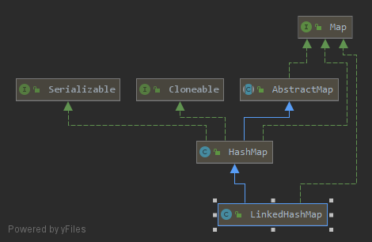

# LinkedHashMap源码分析(JDK1.8)

**要点：**

1. 定义
2. 有什么特点？
3. 继承树
4. 字段属性
5. 构造函数
6. 常用方法
7. 适用场景
8. 和LinkedHashSet的关系


## 1. 定义

```java
public class LinkedHashMap<K,V>
    extends HashMap<K,V>
    implements Map<K,V
```


# 2. 有什么特点？

LinkedHashMap继承自HashMap，和HashMap最大的区别在于==HashMap是无序插入==，而==Linked是有序插入==，并且为了保证元素迭代顺序，**单独维护一个具有所有数据的双向链表**

其他部分大多与HashMap相同


## 3.继承树



继承自HashMap并实现Map接口，没什么可说的，HashMap该有的他都有，并增加了元素插入顺序记录

## 4.字段属性

```java
//内部类Entry继承自HashMap中的Node类，比起Node，添加了前后指针，以便维护插入的先后顺序
static class Entry<K,V> extends HashMap.Node<K,V> {
    Entry<K,V> before, after;
    Entry(int hash, K key, V value, Node<K,V> next) {
        super(hash, key, value, next);
    }
}

//序列化与反序列化时验证用的UID
private static final long serialVersionUID = 3801124242820219131L;

//指向双向链表的头部
transient LinkedHashMap.Entry<K,V> head;

//指向双向链表的尾部
transient LinkedHashMap.Entry<K,V> tail;

//true表示访问顺序
//false按照插入顺序
final boolean accessOrder;
```


## 5. 构造函数

### 无参构造

```java
//调用HashMap的构造方法，默认按照插入顺序
public LinkedHashMap() {
    super();
    accessOrder = false;
}
```


### 有参构造

```java
//默认插序，其余和HashMap无异
public LinkedHashMap(int initialCapacity, float loadFactor) {
    super(initialCapacity, loadFactor);
    accessOrder = false;
}

public LinkedHashMap(int initialCapacity) {
    super(initialCapacity);
    accessOrder = false;
}

public LinkedHashMap(Map<? extends K, ? extends V> m) {
    super();
    accessOrder = false;
    putMapEntries(m, false);
}
```


## 6. 常用方法

### 添加元素

同HashMap一致，不过在此基础上重写了部分方法：

```java
//新节点，因为需要记录新节点与链表的顺序连接关系
Node<K,V> newNode(int hash, K key, V value, Node<K,V> e) {
    //Node变为Entry
    LinkedHashMap.Entry<K,V> p =
        new LinkedHashMap.Entry<K,V>(hash, key, value, e);
    //新增linkNodeLast方法，默认添加到表尾
    linkNodeLast(p);
    return p;
}
//尾节点指向p，如果原本链表为空，p的前驱设为null
private void linkNodeLast(LinkedHashMap.Entry<K,V> p) {
    LinkedHashMap.Entry<K,V> last = tail;
    tail = p;
    if (last == null)
        head = p;
    else {
        p.before = last;
        last.after = p;
    }
}
```

```java
//新红黑树节点，也要记录红黑树上的节点顺序连接关系
TreeNode<K,V> newTreeNode(int hash, K key, V value, Node<K,V> next) {
    TreeNode<K,V> p = new TreeNode<K,V>(hash, key, value, next);
    //添加到队尾
    linkNodeLast(p);
    return p;
}
```

**下面两者虽说是重写，但是HashMap中只存在空方法，也即是Linked中才有效的方法：**

```java
// move node to last
//将最后访问过的元素放到顺序链表尾部,当accessOrder=true时才生效
void afterNodeAccess(Node<K,V> e) { 
    LinkedHashMap.Entry<K,V> last;
    //判断accessOrder是否为true且插入的节点是否为等于非尾结点
    //如果是尾结点就不需要操作了
    if (accessOrder && (last = tail) != e) {
        //记录当前节点的前驱和后继
        LinkedHashMap.Entry<K,V> p =
            (LinkedHashMap.Entry<K,V>)e, b = p.before, a = p.after;
        //因为放在尾部，p的后继设为null
        p.after = null;
        //如果p没有前驱，那么a设为头节点，因为p在表尾
        if (b == null)
            head = a;
        //否则按照...b、a、p连接
        else
            b.after = a;
        
        if (a != null)
            a.before = b;
        //如果p的后继不存在，按照....b、p连接，b设为last
        else
            last = b;
        //如果last为null，即p没有前驱也没有后继，那么p此时也是头结点
        if (last == null)
            head = p;
        //last不为null，将last与p正确连接，即...last、p
        else {
            p.before = last;
            last.after = p;
        }
        //尾结点设为p
        tail = p;
        //更新modeCount,用于快速失败验证
        ++modCount;
    }
}
```

```java
//移除最老的头节点，不常用，暂不讨论(其实是懒)
void afterNodeInsertion(boolean evict) { // possibly remove eldest
    LinkedHashMap.Entry<K,V> first;
    
    if (evict && (first = head) != null && removeEldestEntry(first)) {
        K key = first.key;
        removeNode(hash(key), key, null, false, true);
    }
}
```

### 删除元素

同理，重写了remove中的afterNodeRemoval空方法

```java
void afterNodeRemoval(Node<K,V> e) { // unlink
    //记录节点的前驱和后继
    LinkedHashMap.Entry<K,V> p =
        (LinkedHashMap.Entry<K,V>)e, b = p.before, a = p.after;
    //释放p的前驱和后继
    p.before = p.after = null;
    //如果p为头部，那么p的后继设为头部
    if (b == null)
        head = a;
    //否则按照...b、a...排列
    else
        b.after = a;
    //如果p为尾部，那么p的前驱设为尾部
    if (a == null)
        tail = b;
    //否则按照...b、a...排列
    else
        a.before = b;
}
```

### 修改元素 & 查找元素

同HashMap，唯一不同的是如果accessOrder=true时，afterNodeAccess将会生效，最后访问的元素将会被放到顺序链表的尾部


### 集合遍历

1. 加强型for循环
2. 迭代器：取得entrySet的迭代器进行遍历


## 7. 适用场景

同HashMap,如果==需要使用Map的插入顺序时优先使用LinkedHashMap==，否则没有必要使用


## 8. 和LinkedHashSet的关系

前面已经讨论了HashMap和HashSet的关系，那么LinkedHashMap和LinkedHashSet的关系也非常好理解，LinkedHashSet继承自HashSet,构造方法全部来自HashSet，而HashSet中有一项构造方法调用的是LinkedHashMap的构造方法，LinkedHashMap所调用的正是这个

```java
HashSet(int initialCapacity, float loadFactor, boolean dummy) {
    map = new LinkedHashMap<>(initialCapacity, loadFactor);
}
```

也就是说LinkedHashSet底层使用LinkedHashMap实现，除此之外只有serialVersionUID与HashSet不同