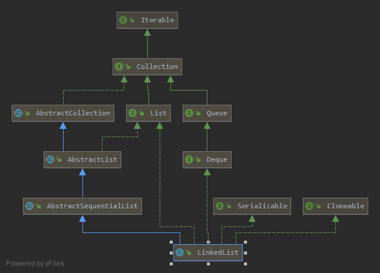
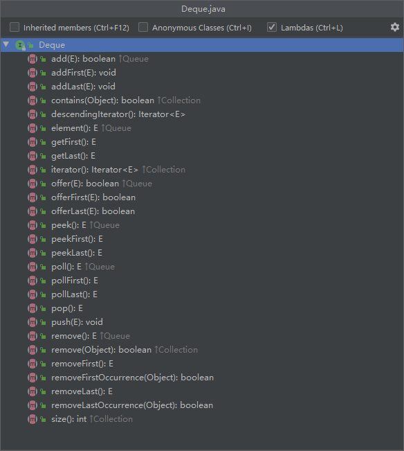

# LinkedList源码分析（JDK1.8）

**要点：**

1. 定义
2. 有什么特点？
3. 继承树
4. 字段属性
5. 构造函数
6. 常用方法
7. 适用场景


## 1. 定义

底层使用双向链表实现的动态数组

```java
public class LinkedList<E>
    extends AbstractSequentialList<E>
    implements List<E>, Deque<E>, Cloneable, java.io.Serializable
```

## 2.有什么特点？

- 与ArrayList对比，LinkedList插入和删除操作更加高效，随机访问速度慢；

- 可以作为栈、队列、双端队列数据结构使用；

- 非同步，线程不安全；

- 与ArrayList、Vector一样，LinkedList的内部迭代器存在“快速失败行为”；

- 支持null元素、有顺序、元素可以重复；


## 3. LinkedList的继承树



可以看到，LinkedList继承自AbstructSequentialList类，实现了以下几个接口：

- Queue: 定义了一系列队列的基本方法

  

- Cloneable：标记接口，表示该类可以克隆，实现该接口才可以调用浅拷贝Object.clone()

- Serializable：标记接口，表示能被序列化

- List：定义了一系列必须实现的List方法，下面详细解释

与ArrayList不同，没有实现RandomAccess标记接口，因为LinkedList不支持快速随机访问


## 4. 字段属性

```java
//节点个数，初始为0
transient int size = 0;
//链表首节点
transient Node<E> first;
//链表尾节点
transient Node<E> last;
```

其中Node为一个内部类：定义了链表节点的基本属性，值和前后指针

```java
private static class Node<E> {
        E item;
        Node<E> next;
        Node<E> prev;

        Node(Node<E> prev, E element, Node<E> next) {
            this.item = element;
            this.next = next;
            this.prev = prev;
        }
    }
```


## 5. 构造函数

无参构造：生成一个空链表

```java
public LinkedList() {}
```

有参构造：使用已有容器类进行构造，调用addAll方法将元素添加进集合中

```java
public LinkedList(Collection<? extends E> c) {
        this();
        addAll(c);
    }
```

addAll()：

```java
//默认添加全部元素
public boolean addAll(Collection<? extends E> c) {
    return addAll(size, c);
}
//从index号开始加入进集合
public boolean addAll(int index, Collection<? extends E> c) {
    //传入集合类的越界判定
    checkPositionIndex(index);
	
    Object[] a = c.toArray();//传入的集合转为数组
    int numNew = a.length;//取得该数组长度
    if (numNew == 0)
        return false;    //如果为长度0，直接返回false

    Node<E> pred, succ;   //前后指针
    if (index == size) {
        succ = null;
        pred = last;
    } else {
        succ = node(index);
        pred = succ.prev;
    }
	//遍历数组，逐一加入到List中
    for (Object o : a) {
        @SuppressWarnings("unchecked") E e = (E) o;
        Node<E> newNode = new Node<>(pred, e, null);
        if (pred == null)
            first = newNode;
        else
            pred.next = newNode;
        pred = newNode;
    }
	
    //
    if (succ == null) {
        last = pred;
    } else {
        pred.next = succ;
        succ.prev = pred;
    }
	
    //更新size，modCount
    size += numNew;
    modCount++;
    return true;
}
```

checkPosition：判断越界

```java
private void checkPositionIndex(int index) {
        if (!isPositionIndex(index))
            throw new IndexOutOfBoundsException(outOfBoundsMsg(index));
    }
```


## 6. 常用方法

- 增删改查

- 遍历集合

**添加元素：**

1. addFirst：在表头出添加元素

   ```java
   public void addFirst(E e) {
           linkFirst(e);
       }
       
   private void linkFirst(E e) {
           final Node<E> f = first;//f指向头结点
           final Node<E> newNode = new Node<>(null, e, f);//新节点前驱设为null，后继设为f
           first = newNode;//头结点设为新节点，添加完成
           if (f == null)
               last = newNode;  //如果集合原来为空，则尾结点也设为新节点
           else
               f.prev = newNode;//否则f的前驱设为新节点
           //更新size和modCount
       	size++;
           modCount++;
       }
   ```

2. addLast：在表尾添加元素

   ```java
   public void addLast(E e) {
           linkLast(e);
       }
   
   //和前者类似，不多做赘述
   void linkLast(E e) {
           final Node<E> l = last;
           final Node<E> newNode = new Node<>(l, e, null);
           last = newNode;
           if (l == null)
               first = newNode;
           else
               l.next = newNode;
           size++;
           modCount++;
       }
   ```

3. addAll：构造方法中已经分析过，不多做赘述

4. add：默认为addLast

**删除元素：**

1. removeFirst：移除表头元素

   ```java
   //如果集合为空，抛出NoSuchElementException异常
   public E removeFirst() {
           final Node<E> f = first;
           if (f == null)
               throw new NoSuchElementException();
           return unlinkFirst(f);
       }
   
   private E unlinkFirst(Node<E> f) {
           // assert f == first && f != null;
           final E element = f.item; 
           final Node<E> next = f.next;//next为头结点的下一个节点
           f.item = null;
           f.next = null;  // help GC //设为null以便GC回收内存
           first = next;  //更新头结点
           if (next == null)
               last = null;   //如果集合原本只有一个元素，则将尾结点设为null
           else
               next.prev = null;//否则由于next是头结点，前驱设为null
           //更新size，modCount，返回更新后的集合
       	size--;
           modCount++;
           return element;
       }
   ```

2. removeLast：移除表尾元素，与前者类似

3. remove()：默认为removeFirst

4. remove(int index)：删除指定索引的元素

   ```java
   public E remove(int index) {
       	//越界判定
           checkElementIndex(index);
           return unlink(node(index));//node(index)返回对应索引的node对象
       }
       
   E unlink(Node<E> x) {
           // assert x != null;
           final E element = x.item;
           final Node<E> next = x.next;//next为x的后继
           final Node<E> prev = x.prev;//prev为x的前驱
   
           if (prev == null) {
               first = next;    //如果前驱为null，直接将头结点设为next
           } else {
               prev.next = next;
               x.prev = null;   //否则前驱的后继设为next，x.prev设为null以便GC回收内存
           }
   
           if (next == null) {
               last = prev;   //同理
           } else {
               next.prev = prev;
               x.next = null;  //后继的前驱设为prev，x.next设为null以为GC回收内存
           }
   		
       	//删除节点内容
           x.item = null;
       	//更新size，modCount，返回更新后的集合
           size--;
           modCount++;
           return element;
       }
   ```

5. remove(Object o):同上，调用unlink(Node<E> x)进行删除

**修改元素：**越界判定+根据索引取得对象并修改，没什么可说的

```java
public E set(int index, E element) {
        checkElementIndex(index);
        Node<E> x = node(index);
        E oldVal = x.item;
        x.item = element;
        return oldVal;
    }
```

**查找元素：**

1. getFirst：获取表头元素

2. getLast：获取表尾元素

3. get(int index):根据索引获取指定位置元素

4. indexOf(Object o)：返回第一个equals o的元素索引

   ```java
   public int indexOf(Object o) {
           int index = 0;
       	//如果查找对象为空，遍历集合是否存在null，并返回第一个索引
           if (o == null) {
               for (Node<E> x = first; x != null; x = x.next) {
                   if (x.item == null)
                       return index;
                   index++;
               }//否则用equals判断是否相同
           } else {
               for (Node<E> x = first; x != null; x = x.next) {
                   if (o.equals(x.item))
                       return index;
                   index++;
               }
           }
       	//如果不存在返回-1
           return -1;
       }
   ```

**集合遍历：**

1. for循环+get(index)

2. 迭代器：取得迭代器，使用hasNext进行遍历

   ```java
   public ListIterator<E> listIterator(int index) {
           checkPositionIndex(index);
           return new ListItr(index);
       }
   ```

   ```
   ListIterator iterator = list.listIterator();
   while(iterator.hasNext()){
   	....
   }
   ```

效率对比：对数据规模为100000的集合遍历，对比两者的性能

显然,前者由于每次都要重新遍历集合取得元素，时间复杂度为$O(n^2)$,后者则为$O(n)$

```java
public class Main {

    public static void main(String[] args) {
        LinkedList<Integer> linkedList = new LinkedList<>();
        //插入100000条数据
        for(int i = 0 ; i < 100000; i++){
            linkedList.add(i);
        }
        //分别测试运行时间
        long beginTimeFor = System.currentTimeMillis();
        for(int i = 0 ; i < linkedList.size() ; i++){
            linkedList.get(i);//do something module
        }
        long endTimeFor = System.currentTimeMillis();
        System.out.println("for cost time: "+ (endTimeFor - beginTimeFor)+"ms");


        long beginTimeIte = System.currentTimeMillis();
        Iterator<Integer> it = linkedList.listIterator();
        while(it.hasNext()){
            it.next();//do something module
        }
        long endTimeIte = System.currentTimeMillis();
        System.out.println("iterator cost time: "+ (endTimeIte - beginTimeIte)+"ms");
    }
}
```


为了消除时间复杂度带来的影响，对for循环所需时间开方

由测试结果可见，当数据规模较大时，使用迭代器进行循环依然将大大提高效率(将近100倍的提升)


## 7. 适用场景

由以上分析可见，由于底层是用==链表==实现的，通过索引查找消耗O(n)的时间，因此LinkedList==不适合快速随机访问操作==，而增删操作则只消耗O(1)的时间，==增删操作==


